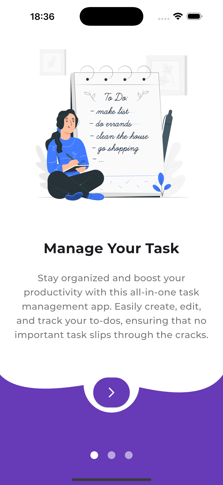
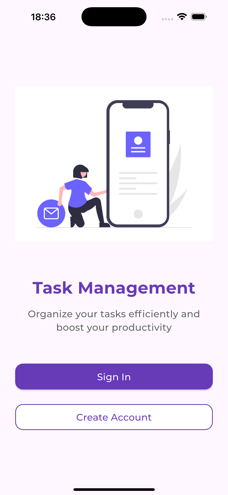
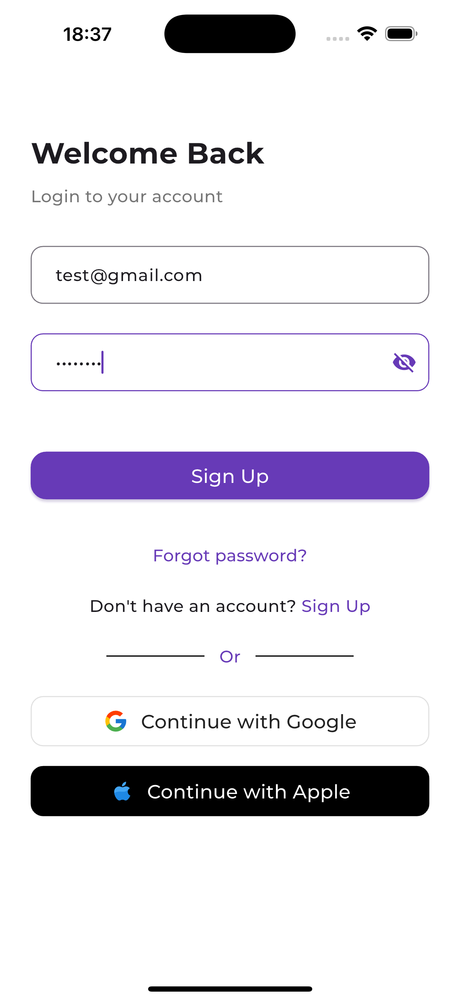
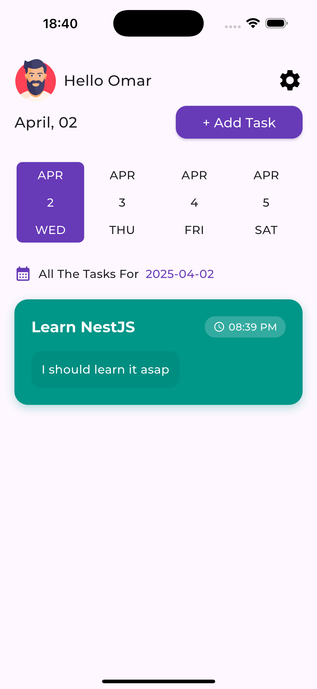
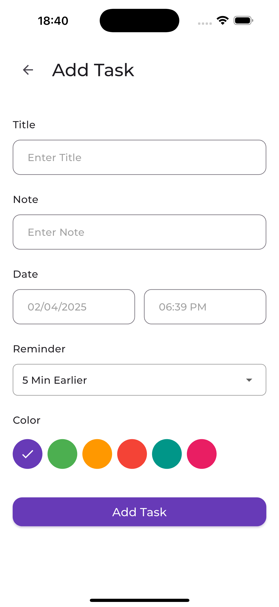
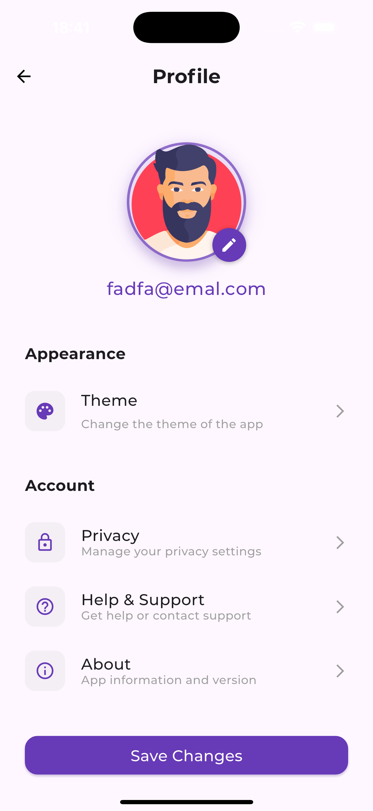
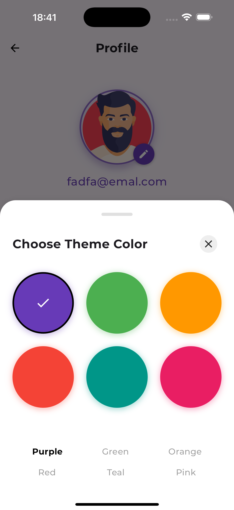
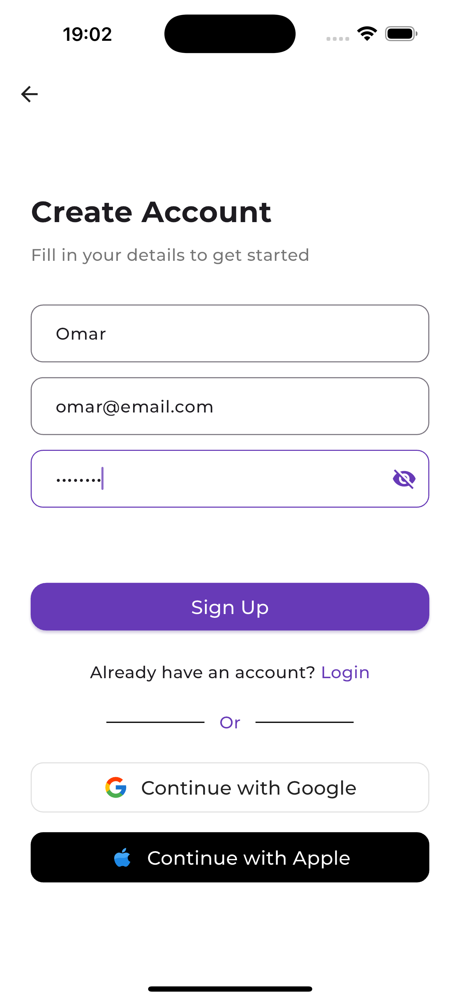
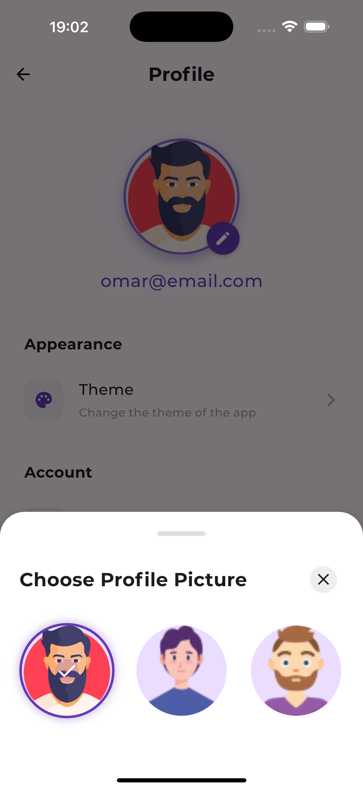

# Todo App

Một ứng dụng **Quản lý công việc (Todo App)** được xây dựng bằng **Flutter** giúp người dùng theo dõi và quản lý công việc hằng ngày một cách đơn giản và hiệu quả.

## Tính năng chính

-  Hiển thị danh sách công việc
-  Thêm công việc mới
-  Chỉnh sửa công việc
-  Xóa công việc
-  Thông báo cho công việc
-  Hỗ trợ Android / iOS / Web

## Công nghệ sử dụng

- Dart
- Flutter
- Firebase

## Getting Started

### Run project
- Get dependencies
```sh
flutter pub get
```

- Run
```sh
flutter run
```
### Preview

<p align="center">
  
  
  
</p>

<p align="center">
  
  
  
</p>

<p align="center">
  
  
  
</p>
